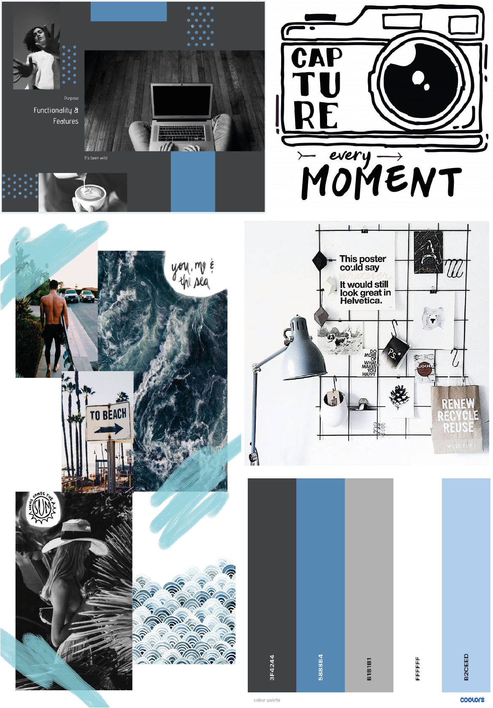

# Portfolio Website

url: https://irahrosete.com

GitHub: https://github.com/irahrosete/portfolio-site

### Purpose
This online portfolio aims to present myself as a budding developer and applies the skills that I have learned so far in HTML and CSS to showcase my work. This serves as a starting point for future improvements as I continue to enhance my skills throughout the course of my career.

### Functionality and Features
The website is a static site featuring:
- a landing page
- an about page
- a featured works page
- a blog page and
- a contact page

It is fully responsive on various mobile and tablet devices, as well as laptop and desktop screens. The pages are accessed through the hamburger menu on all screen sizes, and the text size increases with screen size to ensure readability. It was coded using semantics to ensure accessibility.

The site features a consistent soft dark theme across all pages which passed web accessibility contrast test. My logo, which is positioned prominently next to the hamburger menu at the top navigation bar, allows users to get back to the landing page from any page. The format of the navigation bar is consistent across all the pages to offer familiarity to the user.

The site provides an easy link to my resmume and links to my professional and social media accounts.

The stylesheet features subresource integrity to ensure that the site is rendered without malicious manipulation.

### Target Audience
This portfolio targets to engage potential employers in the tech industry.

### Tech Stack
        

### Sitemap

### Wireframes

### Mockups

### Mood Board

### Web Accessibility
